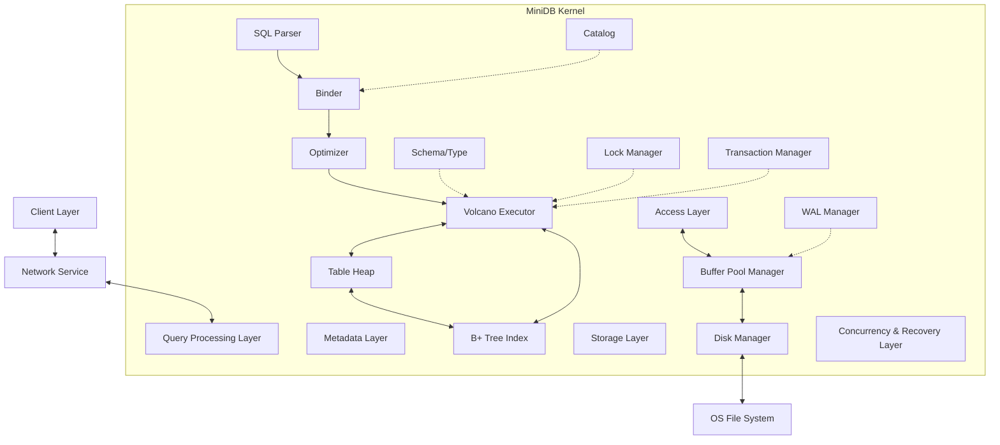

# Design Documentation of MiniDB

> Author: Hunky Hsu
>
> Version: 2.0
>
> Last Updated: 2026-3-2

## 0. Table of Contents

- Quick Start
  - Prerequisites
  - Installation
  - Run Your First Query
  - Next Steps

- Introduction
  - What is MiniDB?
  - Scope & Goals
  - Requirements
  - Key Features

- Architecture & Layers
- Getting Started Guide
  - Building From Source
  - Running Tests
  - Configuration
  - Basic Usage Examples

- Package Structure
- File Format & Persistence
- Layer1: Storage
- Layer2: Access
- Layer3: Catalog
- Layer4: Query Processing 
- Layer5: Concurrency & Recovery
- Layer6: Client
- API Reference
- Configuration Reference 
  - Configuration File Format
  - Configuration Options
  - Tuning Guide

- Error handling
- Testing Strategy
- Performance Analysis
- Examples & Tutorials
  - Basic CRUD Operations
  - Transaction Example
  - Index Usage
  - Crash Recovery Demo

- Troubleshooting
  - Common Issues
  - Debugging Tips
  - FAQ

- Development Guide
  - Setting Up Development Environment
  - Contributing Guidelines
  - Architecture Decision Records (ADR)

- Roadmap & Future Work
  - Current Status
  - Upcoming Features
  - Known Limitations

- Changelog
  - v2.0.0 (2026-03-02)

- References & Resources
  - Academic Papers
  - Related Projects
  - Learning Resources

- Appendix A: Glossary

- Appendix B: License


## 2. Introduction

This document provides a comprehensive architectural overview of MiniDB. It details the system's layered architecture, component interactions, package structure, and the engineering specifications for MiniDB. 

### 2.1 What is MiniDB?

MiniDB is a disk-oriented, single-node relational database management system (DRDBMS) based on Java. 

MiniDB supports a large part of the SQL standard and its primary goal is to serve as a robust prototype for learning and demonstrating core database internals:

- Basic Queries
- ARIES Recovery 
- Mutil-Version Concurrency Control
- 2PL
- Volcano Execution Model

> Need to be added: views, foreign keys, window functions, inheritance, triggers

MiniDB puts code readability, modularity, and adherence to academic/industry standards to the first.

### 2.2 Scope & Goals

**Doing**:

- Storage Layer: Heap Table + B+ Tree Index
- Searching Layer: basic CRUD + WHERE + SELECT col
- Transaction: ACID + Row-level Locking + Crash Recovery
- Interface: basic SQL subsets +network interface compatible with the MySQL protocol

**Not Doing**:

- Distributed: Sharding and replication are not supported
- Complex Queries: Complex JOIN algorithms (such as Hash Join, Sort-Merge Join) are not currently supported; only Nested Loop Join is supported (if required). Complex aggregations (GROUP BY, HAVING) are not currently supported
- Advanced Features: Views, Stored Procedures, and Triggers are not supported
- Data Types: Only basic types (Integer, Varchar) are supported; Blob, JSON, GIS, etc., are not supported

### 2.3 Requirements

**Functional Requirements**

DDL (Data Definition Language):

- Supports `CREATE TABLE` (supports primary key declaration)

- Supports `CREATE INDEX` (creates B+ tree indexes for specific columns)

> ALTER TABLE or DROP TABLE are not currently supported

DML (Data Manipulation):

- Supports INSERT INTO ... VALUES ...

- Supports DELETE FROM ... WHERE ...

- Supports UPDATE ... SET ... WHERE ...

- Supports SELECT ... FROM ... WHERE ... (including simple single-table conditional filtering and cross-table Nested Loop Join).

Transaction Capabilities:

- Supports explicit transaction control with BEGIN, COMMIT, and ROLLBACK.

- Provides ACID guarantees.

Protocols and Interfaces:

- Provides a Netty-based TCP server using the MySQL protocol (Client handshake, Auth, Query Packet, Result Set Packet). 2. Non-functional Requirements and Constraints

Resource Constraints:

Page Size: Fixed at 4KB (4096 Bytes), aligned with the page size of most operating systems and the physical sectors of SSDs.

Buffer Pool Size: Configurable; the system starts with a small memory footprint (e.g., 1024 pages, or 4MB) to ensure smooth operation and debugging on any ordinary laptop.

Single-line Record Limit: Due to the lack of support for overflow page/BLOB storage, the maximum length of a single tuple cannot exceed the payload of one page (approximately 4000 Bytes).

Reliability Objectives:

Crash Recovery Semantics: Follows the ARIES algorithm's Steal/No-Force strategy. Even if the process is forcibly terminated with `kill -9`, it can recover committed transactions and roll back uncommitted transactions after restarting via Write-Ahead Logging (WAL).

Observability:

Use a unified logging framework (e.g., SLF4J + Logback).

Provide simple internal status queries (e.g., returning Buffer Pool hit rate and current active transaction count via special SQL statements like `SHOW STATUS`).

Performance Targets:

Correctness First is the primary objective.

Baseline Target: With a 100% Buffer Pool Hit Rate, a single-threaded Point Query (using primary key SELECT) should achieve a throughput of 10,000+ QPS.

## 3. Architecture & Layers

MiniDB adopts a classic **Layered Architecture**. This design promotes separation of concerns, maintainability, and loose coupling between components. The system is vertically organized into six distinct layers, ranging from the low-level disk I/O to the high-level network interface.

### 3.1 System Architecture Diagram 

The following diagram illustrates the high-level architecture and the data flow between layers:



--------------------------------------------

The following diagram depicts the lifecycle of a SQL query within MiniDB:

Example: 


### 3.2 Layer Descriptions

MiniDB is structured into the following 6 layers:

#### **L1: Storage Layer **

- **Responsibility**: Acts as the bridge between the OS file system and the database's memory. It abstracts disk I/O operations and manages memory caching to bridge the speed gap between disk and RAM.
- **Key Components**:
  - `DiskManager`: Handles raw file I/O using Java NIO (`FileChannel`), managing page allocation and deallocation.
  - `BufferPoolManager`: Manages a pool of in-memory pages using a replacement policy (e.g., LRU), providing `fetch`, `unpin`, and `flush` interfaces.
  - `LRUReplacer`: Implements the Least Recently Used algorithm to victimize frames when the pool is full.
  - `Page`: The basic unit of storage (typically 4KB), serving as a container for raw bytes.
  - Latch & Free space manager

#### **L2: Access Layer**

- **Responsibility**: Defines how data is physically organized within pages and files. It encapsulates "raw bytes" into meaningful data structures like Tuples and Indexes.
- **Key Components**:
  - `TableHeap`: Manages a doubly-linked list of pages to form a logical table.
  - `TablePage`: Implements the **Slotted Page** layout to store variable-length tuples efficiently.
  - `Tuple`: Represents a single row of data (without schema interpretation in this layer).
  - `Index (B+ Tree)`: Provides efficient data retrieval paths.
  - RecordId & Slotted page

#### **L3: Metadata Layer**

- **Responsibility**: Defines the "Type System" and semantic context of the data. It allows the system to interpret a byte array as specific data types (Integer, Varchar, etc.).
- **Key Components**:
  - `Schema` & `Column`: Defines the structure of tables.
  - `Type` & `Value`: Handles data serialization, deserialization, and comparison logic.
  - `Catalog`: A central repository managing metadata for all tables and indexes.
  - System table & stats

#### **L4: Query Processing Layer **

- **Responsibility**: Parses SQL queries, optimizes execution plans, and executes them.
- **Key Components**:
  - `Parser`: Converts SQL strings into an Abstract Syntax Tree (AST).
  - `Binder`: Validates identifiers against the Catalog.
  - `Optimizer`: Generates efficient physical execution plans.
  - `Executor`: Executes the plan using the **Volcano Model** (Iterator Model), where operators utilize `next()` to process tuples.
  - Expression evaluator

#### **L5: Concurrency & Recovery Layer**

- **Responsibility**: Ensures the ACID properties of transactions. This is a cross-cutting layer that interacts with execution and storage.
- **Key Components**:
  - `LockManager`: Implements **2PL(Two-Phase Locking) + MVCC hybrid** to guarantee isolation.
  - `LogManager`: Handles **WAL (Write-Ahead Logging)** to ensure atomicity and durability.
  - `TransactionManager`: Manages transaction states (Begin, Commit, Abort).
  - dead lock detector & Recovery manager & checkpoint manager

#### **L6: Client Layer**

- **Responsibility**: Handles network communications and protocol encapsulation.
- **Key Components**:
  - `NettyServer`: A high-performance NIO server.
  - `ProtocolHandler`: Decodes requests (e.g., MySQL Protocol) and encodes results.
  - session/connection pool & result serialization   

1

## 5. Package Structure

The source code is organized to reflect the layered architecture, ensuring strict visibility and dependency control.

```
com.hunkyhsu.minidb
├── client           // [L6] Network & Protocol
│   ├── NettyServer.java
│   └── protocol
├── execution        // [L4] Query Processing
│   ├── executor     // SeqScan, Insert, Filter, etc.
│   ├── planner
│   └── parser
├── catalog          // [L3] Metadata
│   ├── Catalog.java
│   └── Schema.java
├── type             // [L3] Type System
│   ├── Value.java
│   └── Type.java
├── storage          // [L1 & L2] Storage Engine
│   ├── DiskManager.java        // [L1]
│   ├── BufferPoolManager.java  // [L1]
│   ├── Page.java               // [L1]
│   ├── index                   // [L2] B+Tree implementation
│   └── table                   // [L2] Table implementation
│       ├── TableHeap.java
│       ├── TablePage.java
│       └── Tuple.java
├── concurrency      // [L5] Concurrency Control
│   ├── LockManager.java
│   └── Transaction.java
└── recovery         // [L5] Recovery
    ├── LogManager.java
    └── WAL.java
```


## 7. Physical Storage Layer


- **Responsibility**: Acts as the bridge between the OS file system and the database's memory. It abstracts disk I/O operations and manages memory caching to bridge the speed gap between disk and RAM.
- **Key Components**:
  - `DiskManager`: Handles raw file I/O using Java NIO (`FileChannel`), managing page allocation and deallocation.
  - `BufferPoolManager`: Manages a pool of in-memory pages using a replacement policy (e.g., LRU), providing `fetch`, `unpin`, and `flush` interfaces.
  - `LRUReplacer`: Implements the Least Recently Used algorithm to victimize frames when the pool is full.
  - `Page`: The basic unit of storage (typically 4KB), serving as a container for raw bytes.
  - Latch & Free space manager

## 8. Access Layer


## 9. Metadata Layer


## 10. Query Processing Layer

> Not Doing: 
>
> Supports PreparedStatement statements + Generates Query IDs + Syntax tree caching + Parameter placeholder handling
>
> 

The pipeline or the lifecycle of a query strictly follows 
$$
\text{SQL String}\xrightarrow{\text{Parser}}\text{AST}\xrightarrow{\text{Binder}}\text{Bound AST}\xrightarrow{\text{Planner}}\text{Logical Plan}\xrightarrow{\text{Optimizer}}\text{Physical Plan}\xrightarrow{\text{Executor}}\text{Result}
$$
Specifily, the processing components are:

- Parser = JsqlParser 
- Binder = 
- Optimizer = RBO optimizer
- Executor = Volcano executor

### 10.1 Parser Stage


### 10.2 Binder Stage


### 10.3 Planner Stage


### 10.4 Optimizer Stage


### 10.5 Executor Stage


## 11. Concurrency Layer

MiniDB currently uses a **Coarse-Grained Locking** strategy for internal data structures.

- **Latch (Internal Lock)**: Protects critical sections within the `BufferPoolManager` and `DiskManager` using `ReentrantLock`.
- **Transaction Lock (Future Work)**: Will implement Row-Level Locking (S-Lock / X-Lock) managed by a central `LockManager`.


## 12. Client Layer

