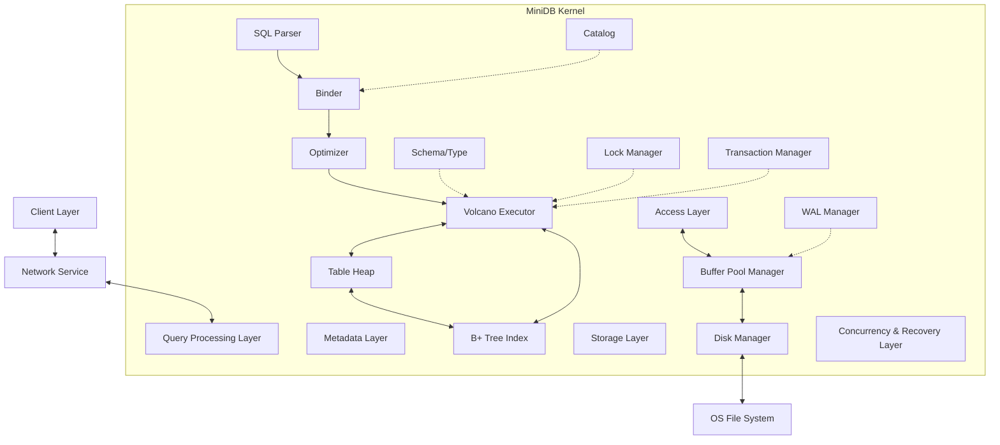

# Design Documentation of MiniDB

> Author: Hunky Hsu
>
> Version: 2.0
>
> Last Updated: 2026-3-2

Prompt： 你是一个数据库系统专业的教授，我是你的学生，我正在使用java编写一个小型的关系型数据库系统minidb，具体参照风格为

 postgreSQL和SQLite，目的是做出一个优质、标准、完整的开源数据库项目，更多偏向工业标准而不是教学标准。我的数据库系统

 的层次可以划分为storage layer, access layer. execution layer, transaction layer, server layer。

## 0. Table of Contents

- Quick Start
  - Prerequisites
  - Installation
  - Run Your First Query
  - Next Steps
- Introduction
  - What is MiniDB?
  - Scope & Goals
  - Requirements
  - Key Features
- Architecture & Layers
- Getting Started Guide
  - Building From Source
  - Running Tests
  - Configuration
  - Basic Usage Examples
- Package Structure
- File Format & Persistence
- Layer1: Storage
- Layer2: Access
- Layer3: Catalog
- Layer4: Query Processing 
- Layer5: Concurrency & Recovery
- Layer6: Client
- API Reference
- Configuration Reference 
  - Configuration File Format
  - Configuration Options
  - Tuning Guide
- Error handling
- Testing Strategy
- Performance Analysis
- Examples & Tutorials
  - Basic CRUD Operations
  - Transaction Example
  - Index Usage
  - Crash Recovery Demo
- Troubleshooting
  - Common Issues
  - Debugging Tips
  - FAQ
- Development Guide
  - Setting Up Development Environment
  - Contributing Guidelines
  - Architecture Decision Records (ADR)
- Changelog
  - v2.0.0 (2026-03-02)
- Appendix A: Glossary
- Appendix B: License


## 2. Introduction

This document provides a comprehensive architectural overview of MiniDB. It details the system's layered architecture, component interactions, package structure, and the engineering specifications for MiniDB. 

### 2.1 What is MiniDB?

MiniDB is a disk-oriented, single-node relational database management system (DRDBMS) based on Java. 

MiniDB supports a large part of the SQL standard and its primary goal is to serve as a robust prototype for learning and demonstrating core database internals:

- Basic Queries
- ARIES Recovery 
- Mutil-Version Concurrency Control
- 2PL
- Volcano Execution Model

> Need to be added: views, foreign keys, window functions, inheritance, triggers

MiniDB puts code readability, modularity, and adherence to academic/industry standards to the first.

### 2.2 Scope & Goals

**Doing**:

- Storage Layer: Heap Table + B+ Tree Index
- Searching Layer: basic CRUD + WHERE + SELECT col
- Transaction: ACID + Row-level Locking + Crash Recovery
- Interface: basic SQL subsets +network interface compatible with the MySQL protocol

**Not Doing**:

- Distributed: Sharding and replication are not supported
- Complex Queries: Complex JOIN algorithms (such as Hash Join, Sort-Merge Join) are not currently supported; only Nested Loop Join is supported (if required). Complex aggregations (GROUP BY, HAVING) are not currently supported
- Advanced Features: Views, Stored Procedures, and Triggers are not supported
- Data Types: Only basic types (Integer, Varchar) are supported; Blob, JSON, GIS, etc., are not supported

### 2.3 Requirements

**Functional Requirements**

DDL (Data Definition Language):

- Supports `CREATE TABLE` (supports primary key declaration)

- Supports `CREATE INDEX` (creates B+ tree indexes for specific columns)

> ALTER TABLE or DROP TABLE are not currently supported

DML (Data Manipulation):

- Supports INSERT INTO ... VALUES ...

- Supports DELETE FROM ... WHERE ...

- Supports UPDATE ... SET ... WHERE ...

- Supports SELECT ... FROM ... WHERE ... (including simple single-table conditional filtering and cross-table Nested Loop Join).

Transaction Capabilities:

- Supports explicit transaction control with BEGIN, COMMIT, and ROLLBACK.

- Provides ACID guarantees.

Protocols and Interfaces:

- Provides a Netty-based TCP server using the MySQL protocol (Client handshake, Auth, Query Packet, Result Set Packet). 2. Non-functional Requirements and Constraints

Resource Constraints:

Page Size: Fixed at 4KB (4096 Bytes), aligned with the page fixedSize of most operating systems and the physical sectors of SSDs.

Buffer Pool Size: Configurable; the system starts with a small memory footprint (e.g., 1024 pages, or 4MB) to ensure smooth operation and debugging on any ordinary laptop.

Single-line Record Limit: Due to the lack of support for overflow page/BLOB storage, the maximum length of a single tuple cannot exceed the payload of one page (approximately 4000 Bytes).

Reliability Objectives:

Crash Recovery Semantics: Follows the ARIES algorithm's Steal/No-Force strategy. Even if the process is forcibly terminated with `kill -9`, it can recover committed transactions and roll back uncommitted transactions after restarting via Write-Ahead Logging (WAL).

Observability:

Use a unified logging framework (e.g., SLF4J + Logback).

Provide simple internal status queries (e.g., returning Buffer Pool hit rate and current active transaction count via special SQL statements like `SHOW STATUS`).

Performance Targets:

Correctness First is the primary objective.

Baseline Target: With a 100% Buffer Pool Hit Rate, a single-threaded Point Query (using primary key SELECT) should achieve a throughput of 10,000+ QPS.

## 3. Architecture & Layers

MiniDB adopts a classic **Layered Architecture**. This design promotes separation of concerns, maintainability, and loose coupling between components. The system is vertically organized into six distinct layers, ranging from the low-level disk I/O to the high-level network interface.

### 3.1 System Architecture Diagram 

The following diagram illustrates the high-level architecture and the data flow between layers:



--------------------------------------------

The following diagram depicts the lifecycle of a SQL query within MiniDB:

Example: 


### 3.2 Layer Descriptions

MiniDB is structured into the following 6 layers:

#### **L1: Storage Layer **

- **Responsibility**: Acts as the bridge between the OS file system and the database's memory. It abstracts disk I/O operations and manages memory caching to bridge the speed gap between disk and RAM.
- **Key Components**:
  - `DiskManager`: Handles raw file I/O using Java NIO (`FileChannel`), managing page allocation and deallocation.
  - `BufferPoolManager`: Manages a pool of in-memory pages using a replacement policy (e.g., LRU), providing `fetch`, `unpin`, and `flush` interfaces.
  - `LRUReplacer`: Implements the Least Recently Used algorithm to victimize frames when the pool is full.
  - `Page`: The basic unit of storage (typically 4KB), serving as a container for raw bytes.
  - Latch & Free space manager

#### **L2: Access Layer**

- **Responsibility**: Defines how data is physically organized within pages and files. It encapsulates "raw bytes" into meaningful data structures like Tuples and Indexes.
- **Key Components**:
  - `TableHeap`: Manages a doubly-linked list of pages to form a logical table.
  - `TablePage`: Implements the **Slotted Page** layout to store variable-length tuples efficiently.
  - `Tuple`: Represents a single row of data (without schema interpretation in this layer).
  - `Index (B+ Tree)`: Provides efficient data retrieval paths.
  - RecordId & Slotted page

#### **L3: Metadata Layer**

- **Responsibility**: Defines the "Type System" and semantic context of the data. It allows the system to interpret a byte array as specific data types (Integer, Varchar, etc.).
- **Key Components**:
  - `Schema` & `Column`: Defines the structure of tables.
  - `Type` & `Value`: Handles data serialization, deserialization, and comparison logic.
  - `Catalog`: A central repository managing metadata for all tables and indexes.
  - System table & stats

#### **L4: Query Processing Layer **

- **Responsibility**: Parses SQL queries, optimizes execution plans, and executes them.
- **Key Components**:
  - `Parser`: Converts SQL strings into an Abstract Syntax Tree (AST).
  - `Binder`: Validates identifiers against the Catalog.
  - `Optimizer`: Generates efficient physical execution plans.
  - `Executor`: Executes the plan using the **Volcano Model** (Iterator Model), where operators utilize `next()` to process tuples.
  - Expression evaluator

#### **L5: Concurrency & Recovery Layer**

- **Responsibility**: Ensures the ACID properties of transactions. This is a cross-cutting layer that interacts with execution and storage.
- **Key Components**:
  - `LockManager`: Implements **2PL(Two-Phase Locking) + MVCC hybrid** to guarantee isolation.
  - `LogManager`: Handles **WAL (Write-Ahead Logging)** to ensure atomicity and durability.
  - `TransactionManager`: Manages transaction states (Begin, Commit, Abort).
  - dead lock detector & Recovery manager & checkpoint manager

#### **L6: Client Layer**

- **Responsibility**: Handles network communications and protocol encapsulation.
- **Key Components**:
  - `NettyServer`: A high-performance NIO server.
  - `ProtocolHandler`: Decodes requests (e.g., MySQL Protocol) and encodes results.
  - session/connection pool & result serialization   

1

## 5. Package Structure

The source code is organized to reflect the layered architecture, ensuring strict visibility and dependency control.

```
com.hunkyhsu.minidb
├── client           // [L6] Network & Protocol
│   ├── NettyServer.java
│   └── protocol
├── execution        // [L4] Query Processing
│   ├── executor     // SeqScan, Insert, Filter, etc.
│   ├── planner
│   └── parser
├── catalog          // [L3] Metadata
│   ├── Catalog.java
│   └── Schema.java
├── type             // [L3] Type System
│   ├── Value.java
│   └── Type.java
├── storage          // [L1 & L2] Storage Engine
│   ├── DiskManager.java        // [L1]
│   ├── BufferPoolManager.java  // [L1]
│   ├── Page.java               // [L1]
│   ├── index                   // [L2] B+Tree implementation
│   └── table                   // [L2] Table implementation
│       ├── TableHeap.java
│       ├── TablePage.java
│       └── Tuple.java
├── concurrency      // [L5] Concurrency Control
│   ├── LockManager.java
│   └── Transaction.java
└── recovery         // [L5] Recovery
    ├── LogManager.java
    └── WAL.java
```

## 6. File Format & Persistence


## 7. Physical Storage Layer

> lack of Component Interaction Diagram
>
> lack of Performance Characteristics
>
> lack of Failure Scenario
>
> lack of flush list, etc

### 7.1 Overview

**Responsibility**: The storage layer acts as the bridge between the OS file system and the database's memory. It abstracts disk I/O operations and manages memory caching to bridge the speed gap between disk and RAM.

**Architectural Features**: 

- Using a classic **Buffer Pool + Disk Manager** architecture.

- Using an LRU (Least Recently Used) page replacement strategy.

- Page lifecycle management based on a Pin/Unpin mechanism.

- Using a global lock to ensure thread safety.

**Workflow of physical storage layer**:

The upper layer should only focus on the external interface of buffer pool manager (BPM), which manages the pageTable, freeList, LRUReplacer and DiskManager. The external interface includes `fetchPage()`, `unpinPage()`, `newPage()`, `flushPage()`, `flushAllPages()`, `close()` and `getStats()`.

> For details of external interface, see 7.2.4 Buffer Pool Manager.

### 7.2 Component Spec 

#### 7.2.1 Page

`Page` is the basic unit of storage (typically 4KB), serving as a container for raw bytes.

**Data Structure **:

Here is the information of the core fields of `Page`:

| Field Name | Type         | Description                                                  |
| ---------- | ------------ | ------------------------------------------------------------ |
| `pageId`   | `int`        | A globally unique identifier for the page.                   |
| `pageData` | `ByteBuffer` | A 4KB buffer to store the actual data.                       |
| `isDirty`  | `boolean`    | A marker indicating whether the page has been modified, used to determine if it needs to be written back to disk. |
| `pinCount` | `int`        | A reference count, indicating the number of threads currently using the page. |

Here is the brief description of the core methods of `page`:

- `pin()`: Increase the `pinCount`, indicating the page is currently in use.
- `unpin()`: Decrease the `pinCount`; the page can be evicted when `pinCount = 0`.
- `resetMemory()`: Resets the page's status for reusing.

**Invariants**:

- `pinCount >= 0`, >0 means the page cannot be evicted.
- `pageId == -1` means unallocated page or empty page.
- `pageData.capacity == PAGE_SIZE == 4096 bytes`
- `isDirty == true` only indicates the page has been modified, has no relationship with disk written.

**Error Semantics**:

- `unpin()` is non-throwing and never makes pinCount negative.

**Thread Safety**:

- `Page` itself is not **thread-safe**.
- Modification of `pinCount` must be performed under the protection of the BufferPoolManager's lock.
- Concurrent access to ByteBuffer is synchronized by the caller.

> For details of on-disk layouts and persistence, see Chapter 6: File Format & Persistence

#### 7.2.2 Disk Manager

**Definition**: `DiskManager` is responsible for raw file I/O operations, page allocation/deallocation, and multi-file management. It serves as the lowest-level abstraction between the database and the operating system's file system.

**Core Responsibilities**:

- **Page I/O**: Read and write 4KB pages to/from disk using Java NIO `FileChannel`.
- **Page Allocation**: Allocate new pages using Extent-Based Allocation strategy.
- **Page Deallocation**: Manage freed pages via FreePageList for reuse.
- **Multi-File Management**: Support multiple database files to overcome single-file fixedSize limits.
- **Space Management**: Track total pages, free pages, and preallocated pages.

**Data Structures**:

| Field Name | Type | Description |
|------------|------|-------------|
| `dbFileBasePath` | `String` | Base path for database files (e.g., "test.db") |
| `fileChannels` | `ConcurrentHashMap<Integer, FileChannel>` | Map of file index to FileChannel |
| `numPages` | `AtomicInteger` | Total number of pages across all files |
| `freePages` | `Set<Integer>` | Set of deallocated pages available for reuse |
| `preallocatedPages` | `LinkedBlockingQueue<Integer>` | Queue of pages from preallocated extents |
| `EXTENT_SIZE` | `static final int = 8` | Number of pages allocated per extent |
| `MAX_PAGES_PER_FILE` | `static final int = 524288` | Maximum pages per file (2GB / 4KB) |

**Key Design Decisions**:

2. **Eager Allocation**
   - **Rationale**: Allocate physical space immediately to detect "disk full" errors early.
   - **Benefit**: Fail-fast behavior and avoids sparse file fragmentation.

3. **Extent-Based Allocation**
   - **Strategy**: Allocate 8 pages (32KB) at once instead of single pages.
   - **Benefit**: Reduces system calls by 8x, improves sequential write performance.
   - **Trade-off**: May waste space if pages are not fully utilized.

4. **Three-Tier Allocation Strategy**:
   ```
   Priority 1: FreePageList (reuse deallocated pages)
        ↓ if empty
   Priority 2: Preallocated Pages (from existing extents)
        ↓ if empty
   Priority 3: Allocate New Extent (8 pages at once)
   ```

5. **Multi-File Architecture**
   - **File Naming**: `test.db` (file 0), `test.db.1` (file 1), `test.db.2` (file 2), ...
   - **Page Mapping**: `fileIndex = pageId / MAX_PAGES_PER_FILE`, `pageOffset = pageId % MAX_PAGES_PER_FILE`
   - **Benefit**: Overcomes 2GB single-file limit, better file system compatibility.

**Core Methods**:

- **`readPage(int pageId, Page page)`**:
  - Calculates file index and offset from pageId.
  - Reads 4KB from the appropriate FileChannel.
  - Handles partial reads and validates data integrity.
  - Throws `IOException` if pageId is invalid or read fails.

- **`writePage(int pageId, Page page)`**:
  - Calculates file index and offset from pageId.
  - Writes 4KB to the appropriate FileChannel.
  - Calls `force(false)` to ensure data is synced to disk.
  - Throws `IOException` if pageId is invalid or write fails.

- **`allocatePage()`**:
  - **Step 1**: Check FreePageList for reusable pages (O(1), no disk I/O).
  - **Step 2**: Poll from preallocated pages queue (O(1), no disk I/O).
  - **Step 3**: Allocate new extent if queue is empty (1 system call for 8 pages).
  - Returns the allocated pageId.
  - Throws `IOException` if disk is full.

- **`deallocatePage(int pageId)`**:
  - Adds pageId to FreePageList for future reuse.
  - Does not physically delete data (lazy deletion).
  - Thread-safe using `ConcurrentHashMap.newKeySet()`

- **`allocateExtent()`** (private):
  - Allocates 8 consecutive pages in a single operation.
  - Handles cross-file boundary allocation.
  - Writes zero-filled pages to disk.
  - Adds all 8 pages to preallocated queue.

- **`getOrCreateFileChannel(int fileIndex)`** (private):
  - Lazily creates FileChannel for new files.
  - Uses `computeIfAbsent` for thread-safe creation.
  - Returns existing channel if already open.

**Multi-File Layout Example**:

```
Database: test.db (base path)

File Structure:
├── test.db       (File 0)  → Pages 0 - 524,287      (2GB)
├── test.db.1     (File 1)  → Pages 524,288 - 1,048,575  (2GB)
├── test.db.2     (File 2)  → Pages 1,048,576 - 1,572,863 (2GB)
└── ...

Page Mapping:
- Page 0       → File 0, Offset 0
- Page 524,287 → File 0, Offset 524,287 (last page in file 0)
- Page 524,288 → File 1, Offset 0 (first page in file 1)
- Page 1,000,000 → File 1, Offset 475,712
```

**Extent Allocation Example**:

```
Initial State:
- numPages = 0
- freePages = []
- preallocatedPages = []

allocatePage() #1:
→ Triggers allocateExtent()
→ Allocates pages 0-7 (32KB written to disk)
→ preallocatedPages = [0, 1, 2, 3, 4, 5, 6, 7]
→ Returns page 0

allocatePage() #2-8:
→ Polls from preallocatedPages (no disk I/O)
→ Returns pages 1, 2, 3, 4, 5, 6, 7

allocatePage() #9:
→ preallocatedPages is empty
→ Triggers allocateExtent() again
→ Allocates pages 8-15
→ Returns page 8
```


**Invariants**:

- `numPages` always reflects the total number of pages across all files
- `pageId` is globally unique and monotonically increasing (except for reused pages)
- Each FileChannel corresponds to exactly one database file
- `freePages` contains only valid pageIds within `[0, numPages)`
- `preallocatedPages` contains only pages that have been physically allocated on disk
- File fixedSize is always a multiple of `PAGE_SIZE` (4096 bytes)
- `fileIndex` for a given `pageId` is deterministic: `pageId / MAX_PAGES_PER_FILE`

**Error Semantics**:

- **`readPage()`**:
  - Throws `IllegalArgumentException` if `pageId < 0` or `pageId >= numPages`
  - Throws `IOException` if unexpected EOF or read fails

- **`writePage()`**:
  - Throws `IllegalArgumentException` if `pageId < 0` or `pageId >= numPages`
  - Throws `IOException` if write fails or disk is full

- **`allocatePage()`**:
  - Throws `IOException` if disk is full
  - Rolls back `numPages` on allocation failure

- **`deallocatePage()`**:
  - Logs warning if `pageId` is invalid (does not throw)
  - Idempotent: deallocating the same page multiple times is safe

**Thread Safety**:

- `numPages` uses `AtomicInteger` for atomic increment/decrement
- `freePages` uses `ConcurrentHashMap.newKeySet()` for thread-safe set operations
- `preallocatedPages` uses `LinkedBlockingQueue` for thread-safe queue operations
- `fileChannels` uses `ConcurrentHashMap` with `computeIfAbsent` for lazy initialization
- FileChannel operations are inherently thread-safe for positioned reads/writes

#### 7.2.3 Replacer (LRU)

`Replacer` and `LRUReplacer` implements the Least Recently Used (LRU) algorithm to victimize frames when the pool is full and defines a unified interface for frame replacement strategies, supporting multiple replacement algorithms.

Here is the definition of the interface:

- `int victim()`: Choose a frame and evict it.
- `void pin(int framId)`: Mark a frame as unevictable.
- `void unpin(int frameId)`: Mark a frame as evictable.
- `int fixedSize()`: indicate the number of evictable frames.

As for LRU Replacer, it implements LRU replacement strategy in O(1) complexity because of LinkedHashMap's accessOrder.

**Invariants**:

- Only maintains evictable frames, which meets `pinCount==0` (BPM is responsible).
- `pin(frameId)` indicates the frame get unevictable.
- `unpin(frameId)` indicates the frame get evictable, not stands for cache miss.
- Duplicate calls to `pin(frameId)`: If `frameId` is not already in the LRU queue, `remove` is no-op. Duplicate `pin` calls are idempotent; they do not throw errors or change the state.
- Duplicate calls to `unpin(frameId)`: If `frameId` already exists, it only refreshes the access order. Duplicate `unpin` calls are idempotent and refresh the LRU position.
- Illegal / Non-existent `frameId`: `LRUReplacer` does not perform any validity checks. Validity is guaranteed by the caller (BPM is responsible).

**Error Semantics**:

- `victim()` return -1 when there is no evictable frame.

**Thread Safety**:

- All operations are protected by ReentrantLock.

#### 7.2.4 Buffer Pool Manager

Manages a pool of in-memory frames using a replacement policy (e.g., LRU), providing `fetch`, `unpin`, and `flush` interfaces.

**Data Structure **:

Here is the information of the core fields of `Buffer Pool Manager`:

| Field Name    | Type                                  | Description                               |
| ------------- | ------------------------------------- | ----------------------------------------- |
| `pages`       | `Page[]`                              | A list of frames.                         |
| `pageTable`   | `ConcurrentHashMap<Integer, Integer>` | A mapping between `pageId` and `frameId`. |
| `freeList`    | `LinkedBlockingQueue<Integer>`        | A List of free frames.                    |
| `replacer`    | `Replacer`                            | A frame replacement strategy.             |
| `diskManager` | `DiskManager`                         | A manager for disk I/O operations.        |
| `globalLock`  | `ReentrantLock`                       | A global lock.                            |

Here is the brief description of the core methods of `page`:

- `fetchPage(pageId)`: If a page is found, pin it and remove it from the Replacer, while rewinding the ByteBuffer to the beginning. If a page is not found, retrieve a frame from `freeList` or `Replacer.victim()`. If no frame is available, throw an `IOException`. If the old page is dirty, write it back first, then read the target page and update the `pageTable`, then pin it and remove it from the Replacer.

- `unpinPage(pageId, isDirty)`: If the page is not in the buffer, record a warning and return. If `isDirty=true`, mark the page as dirty. `pinCount--`, when it reaches zero, add it to the Replacer, making it a page to be evicted.

- `flushPage(pageId)`: Returns false if the page is not in the buffer; otherwise, writes it back to disk, clears `isDirty`, and returns true.

- `flushAllPages()`: Iterates through all pages in the `pageTable` and `flushPage()` each one.

- `newPage()`: First, request a new `pageId` from disk, then select an available frame; if no available frame is found, throw an `IOException`; If the old page is dirty, first write it back and remove the old mapping, then reset the page, set the new `pageId`, update the mapping, and pin it; return the new page.

- `deletePage(pageId)`: Returns `false` if the page is not in the buffer; returns `false` if it is pinned; Otherwise, removes the mapping, removes it from the Replacer, resets the page, and puts it back into the `freeList`, returning `true`.

- `getStats()`: Returns the buffer pool status string, including `poolSize`, used/free fixedSize, dirty pages, pinned pages, and the number of evictables.

- `close()`: Cleans up the `pageTable` and `freeList` after `flushAllPages()`.

> BPM.newPage vs. DM.allocatePage:
>
> BPM is responsible for allocating and deallocating the frame ID;
>
> DM is responsible for persistent on disk.

**Invariants**:

- `pageId` from `pageTable` keeps the same with `pages[frameId].pageId`.
- The frame in `freeList` is out of `pageTable`.
- Only the frame meets `pinCount == 0` would be in LRU Replacer.
- The amount of evictable frame equals `replacer.fixedSize()`.

**Error Semantics**:

- `fetchPage()` throws IOException when there is no evictable frames.
- `unpinPage()` logs a warning and return directly when the page is out of buffer.
- `flushPage()` return `false` when the page is out of buffer.
- `deletePage()` retuen `false` when the page get pinned.

**Thread Safety**:

- All operations are protected by global lock: ReentrantLock.

## 8. Access Layer

### 8.1 Overview

**Responsibility**: The Access Layer is the storage-facing data access subsystem of MiniDB. It is responsible for converting raw fixed-fixedSize pages provided by the Storage Layer into structured database records and searchable access paths. This layer defines the physical layout of tuples and index entries, manages page-local and relation-level data organization, and exposes stable row-oriented and index-oriented APIs to the upper layers. 

The Access Layer sits between the Storage Layer and the Query Processing / Transaction layers.

- To the Storage Layer, it acts as a disciplined client of the `BufferPoolManager`, operating strictly through page fetch, page latch, page mutation, and page release protocols.
- To the Query Processing Layer, it exposes logical data access primitives such as tuple insertion, tuple lookup by `RecordId`, sequential table scans, point index probes, and range index scans.
- To the Transaction Layer, it provides the physical objects and hooks required for future concurrency control, logging, recovery, and visibility management.

**Architectural Features**: The Access Layer is composed of two parallel core subsystems implemented through five internal sublayers.

For **subsystem**s, the Access Layer is composed of Heap AM and Index AM (AM = Access Methods):

- **Heap AM (Data Storage)**: Focuses on compact storage and sequential access. Core components include `Tuple`, `RecordId`, `TablePage`, `TableHeap`, and `TableIterator`.

- **Index AM (Data Searching)**: Focuses on fast point-lookups and range scans. In MiniDB, the initial index implementation

   is a B+ tree. Core components include `Index`, `IndexPage` (Internal/Leaf), and `IndexIterator`.

> Why Heap AM + Index AM, NOT index-organized Table?
>
> A: MiniDB adopts a **Heap-Table Architecture** (similar to PostgreSQL and SQLite), explicitly separating data storage from data indexing, rather than using an Index-Organized Table (like MySQL InnoDB).

For **sublayer**s, the Access Layer is composed of:

- **Record Representation**: The Record Representation Sublayer defines how individual logical records are represented in memory and encoded for storage. Core components includes: 
  - **RecordId**: Physical address representation of a page.
  - **TupleData**: Storage the record data and record ID.
  - **TupleCodec**: Encoding and decoding tuple according Schema.
  - **TupleHeader**: Storage the physical header.
  - IndexEntry
  - SeparatorKey
  - IndexCodec

> For detailed specifications of Schema, refer to Section 9 Metadata Layer.
>

- **Page Format**: The Page Format Sublayer defines how records or index entries are organized within a single physical page. Core components includes:
  - TablePage: 
  - BPlusTreePage: 
  - LeafPage: 
  - InternalPage: 
  - SlotDirectory / LinePointer: 

> 但工业化一点的话，slot 不应只是两个 short，更应该显式建模成 line pointer/status

- **Access Method**: The Access Method Sublayer defines the external interface towards the upper layers. Core components includes:
  - TableHeap: Heap AM
  - BPlusTreeIndex: Index AM
  - SearchKey

> 但它现在还缺 relation 级管理信息，比如表的 header page, first/last page 元信息, free space 信息

- **Scan**: The Scan Sublayer defines the stateful traversal mechanisms used by executors and future transaction-aware scans. Core components includes: 
  - TableScanDesc
  - IndexScanDesc
  - HeapCursor
  - IndexCursor

> 真正工业化的扫描状态通常还要带：当前 page/slot, 扫描方向, 条件边界, 锁模式, snapshot/visibility 信息

- **Visibility & Space Management**: The Visibility & Space Management Sublayer defines shared access-layer infrastructure required for industrial-grade correctness, maintainability, and future extensibility.  Core components includes: 
  - FreeSpaceMap
  - VisibilityInfo
  - PageCompactor
  - TableHeaderPage
  - IndexMetadataPage

**Mapping between subsystems and sublayers**: 

| Sublayers                     | Heap AM                                                      | Index AM                                           |
| ----------------------------- | ------------------------------------------------------------ | -------------------------------------------------- |
| Record Representation         | `RecordId`, `HeapTuple`, `TupleHeader`, `TupleCodec`         | `IndexKey`, `IndexEntry`                           |
| Page Format                   | `TablePage`, `LinePointer`                                   | `BPlusTreePage`, `LeafPage`, `InternalPage`        |
| Access Method                 | `TableHeap`                                                  | `BPlusTreeIndex`                                   |
| Scan                          | `TableScanDesc`                                              | `IndexScanDesc`                                    |
| Visibility & Space Management | `TableHeaderPage`, `FreeSpaceMap`, visibility / compaction support | root metadata, free spaceroot metadata, free space |

**Workflow of access layer**:

```mermaid


```

**Interaction Example**: Here is an example that shows how the execution layer, access layer and storage layer interact. There is a query: `SELECT * FROM users WHERE id = 1`:

1. **In query processing layer**: The execution layer evaluates the query plan, triggers an `IndexScan` operator and calls `Index.scan(1)` to find the physical address of the record.
2. **In Index AM**: The `B+ Tree Index` begins its traversal from the root. 
3. 

**External Interfaces**: The upper layer should only focus on and interact with the external interface of Table Heap and Index, which actually returns `Tuple` and `RecordId` to upper-level callers. 

The core external interfaces includes:

- `TableHeap.insertTuple(...)`
-  `TableHeap.getTuple(RecordId)`
-  `TableHeap.updateTuple(...)`
-  `TableHeap.deleteTuple(...)` or `markDelete(...)`
-  `TableHeap.beginScan(...)`
-  `BPlusTreeIndex.insertEntry(...)`
-  `BPlusTreeIndex.deleteEntry(...)`
-  `BPlusTreeIndex.scanKey(...)`
-  `BPlusTreeIndex.beginRangeScan(...)`

> For detailed specifications of these external interfaces, refer to Section 8.2.4 (Table Heap) and Section 8.2.6 (Index).

### 8.2 Component Spec 

This section is arranged in the order of Heap AM followed by Index AM.

#### 8.2.1 Record ID

`RecordId`  or the **RID**, is the globally unique physical coordinate of a tuple within the database file. It serves as the absolute source of truth for locating data and acts as the strict bridge between the Index AM (which stores RIDs) and the Heap AM (which resolves RIDs).

**Data Structure **:

Here is the information of the core fields of `Page`: 

| Field Name | Type    | Description                                                  |
| ---------- | ------- | ------------------------------------------------------------ |
| `pageId`   | `Int`   | A descriptor of the physical page number where the tuple resistes. Size = 4B. |
| `slotId`   | `Short` | A descriptor of the index within the slotted page's slot array. Size = 2B. |

> For detailed specifications of slotted pages, refer to Section 8.2.3 Table Page. 

**Core Methods**

In `RecordId`, `compareTo`, `equals`, `hashCode`, `toString` methods are override to support the transaction management  and observability management in the furture.

**Invariants**:

- Once instantiated, a `RecordId` is strictly immutable. Its internal `pageId` and `slotId` cannot be changed. 

**Thread Safety**:

- Inherently thread-safe due to immutability. Multiple execution threads can safely share and read the same `RecordId` instance without latching.

#### 8.2.2 Record ID


#### 8.2.3 Table Page (Slotted Page)


#### 8.2.4 Table Heap


#### 8.2.5 Table Iterator (Sequential Scan)


#### 8.2.6 Index (B+ Tree) 


#### 8.2.7 Index Pages (Internal + leaf)


#### 8.2.8 Index Iterator (Index Scan)


#### 8.2.9 Scan Descriptor


## 9. Metadata Layer


## 10. Query Processing Layer

> Not Doing: 
>
> Supports PreparedStatement statements + Generates Query IDs + Syntax tree caching + Parameter placeholder handling
>
> 

The pipeline or the lifecycle of a query strictly follows 
$$
\text{SQL String}\xrightarrow{\text{Parser}}\text{AST}\xrightarrow{\text{Binder}}\text{Bound AST}\xrightarrow{\text{Planner}}\text{Logical Plan}\xrightarrow{\text{Optimizer}}\text{Physical Plan}\xrightarrow{\text{Executor}}\text{Result}
$$
Specifily, the processing components are:

- Parser = JsqlParser 
- Binder = 
- Optimizer = RBO optimizer
- Executor = Volcano executor

### 10.1 Parser Stage


### 10.2 Binder Stage


### 10.3 Planner Stage


### 10.4 Optimizer Stage


### 10.5 Executor Stage


## 11. Concurrency Layer

MiniDB currently uses a **Coarse-Grained Locking** strategy for internal data structures.

- **Latch (Internal Lock)**: Protects critical sections within the `BufferPoolManager` and `DiskManager` using `ReentrantLock`.
- **Transaction Lock (Future Work)**: Will implement Row-Level Locking (S-Lock / X-Lock) managed by a central `LockManager`.


## 12. Client Layer

